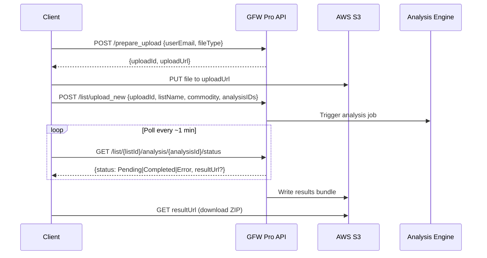

### GFW Pro API Documentation (Markdown Conversion)

This is a Markdown conversion of the uploaded Confluence document, with embedded images replaced by Mermaid diagrams for AI- and developer-friendly consumption.

#### Checking API status
- You can check the API’s status any time at: http://status.globalforestwatch.org/

### Overview
This API is intended for external parties to interact with the Global Forest Watch (GFW) Pro application, with endpoints for:
- Uploading lists
- Enumerating and deleting lists
- Adding analyses to lists
- Generating downloadable results from analyses
- Downloading the results

GFW Pro compartmentalizes all data and access by organizations (user accounts can be added to each organization). The API follows a similar model in that all calls require a token for authentication (specified with X-API-TOKEN key in the HTTP header). This token identifies the organization for the request. Treat the token as highly privileged; rotate keys every three months via Profile → API Keys.

### Getting Started
- You must first have an organization account with GFW Pro (see account request form here): https://pro.globalforestwatch.org/account
- A GFW Pro team member must enable API access (contact your point of contact or gfwprosales@wri.org).
- After access is granted, log in at https://pro.globalforestwatch.org, go to Profile → API Keys to generate API keys.
- A step-by-step guide with screenshots: https://www.globalforestwatch.org/help/gfw-pro/guides/gfw-pro-api-guidance/
- If you need separate production and testing environments, request a separate test-only organization. Use org name “<Your Organization Name> - API Testing” and mark Subsidiary with your parent org. Note test orgs are constrained by standard free usage thresholds (see price sheet): https://www.globalforestwatch.org/help/guides/global-forest-watch-pro-price-sheet/

### Handling Changes
- The API evolves over time, targeting backward compatibility where possible. API version: v1.
- Analysis CSV breaking changes are tracked via minor versions (e.g., 1.1, 1.2) and specified in CSV README files and release notes.

#### Non-breaking Changes
- Adding new endpoints, optional fields, new files in downloads, and new CSV columns/rows (e.g., new Data Layer values) are non-breaking.
- CSVs with README in the title explain columns; contents may change without compatibility guarantees. Clients should be resilient to additional files/columns/values.

#### Breaking Changes
- Some changes (often analysis CSV format) may break backward compatibility. Deprecated CSV versions will be supported for at least two months post-announcement, then removed.
- Beta features labeled [beta testing only] are not subject to backward-compatibility guarantees.

### API Functionality
- Lists are collections of locations (each location is one geometry: point with radius/area, or polygon).
- Results include per-location and whole-list aggregates; note aggregates use dissolved union and may not equal the sum of location-level results.
- Typical flow: upload data → create list + select analyses → download results bundle.
- Uploads and downloads use pre-signed AWS S3 URLs.
- OpenAPI/Swagger docs: accessible via Profile → API Docs (https://pro.globalforestwatch.org/profile). Execute generated curl via CLI with flags -L –post302 (CORS prevents in-browser execution).

### API Endpoints Overview

| Endpoint | Path | Description |
|---|---|---|
| Prepare_upload | /api/v1/prepare_upload | Get pre-signed S3 URL for uploading list data |
| Upload_new | /api/v1/list/upload_new | Create list and trigger analyses for uploaded data |
| Status | /api/v1/list/{listId}/analysis/{analysisId}/status | Check status of an analysis |
| Generate | /api/v1/list/{listId}/analysis/{analysisId}/generate | Generate downloadable results (or verifiable credential for DefReport [beta]) |
| Get list info | /api/v1/list/{listId} | Retrieve basic list info |
| Enumerate all lists | /api/v1/list | List all lists with pagination |
| Delete | /api/v1/list/{listId}/delete | Delete a list |
| Analyze | /api/v1/list/{listId}/analysis/{analysisId}/analyze | Add or re-run an analysis for an existing list |

Analysis IDs: FCD (Forest Change Diagnostics), Alerts, DefReport, GHG [beta testing only].

### Formatting Location Data for GFW Pro

Resources:
- Location/list upload templates: https://drive.google.com/drive/folders/1wcZZIO9U2D9NJ7RE8AjlEtfbR5wZ4Ykc
- How to upload locations and lists: https://www.globalforestwatch.org/help/gfw-pro/guides/upload-locations-lists/
- How to prepare shape files for upload: https://www.globalforestwatch.org/help/gfw-pro/guides/prepare-shapefiles-upload/
- How to prepare GeoJSON files for upload: https://www.globalforestwatch.org/help/gfw-pro/guides/prepare-geojson-files-for-upload/
- How to select the correct file upload template: https://www.globalforestwatch.org/help/gfw-pro/guides/select-correct-template/
- How to complete your selected template: https://www.globalforestwatch.org/help/gfw-pro/guides/complete-selected-template/

Required columns (or shapefile attributes):
1. Location Name (Location_N): only alphanumeric + spaces; max 63 chars. Invalid chars are dropped (not included in outputs/UI).
2. Analysis_R: required for point locations if Analysis_A not provided (non-zero).
3. Analysis_A: required for point locations if Analysis_R not provided (non-zero).
4. Latitude: required for point locations (csv, xlsx, shapefile).
5. Longitude: required for point locations (csv, xlsx, shapefile).
6. yield (optional, for GHG [beta]):
   - Column name is case- and spelling-sensitive.
   - Units: kg/ha.
   - Missing or non-numeric values replaced by defaults where available.

Note: Files with too many locations or too much total area may be blocked from analysis.

Additional file options specific to GHG Emissions analysis [beta]:
- If Commodity matches one of supported values (below), yield is optional; otherwise, yield is required for every location.
- Default yields use SPAM pixel-level yields adjusted for crop intensity; missing SPAM data results in per-location errors like: [NoYieldError(No yield found for <commodity> in <GADM_pixel_location>)].
- Providing actual yields is recommended for accuracy.

### Endpoint Details

#### Prepare_upload
Prepare to upload data by getting a pre-signed S3 URL.

- fileType: csv, xlsx, geojson, zip (shapefiles), kml
- csv/xlsx specify point + radius/area; geojson/kml/shapefile can specify polygons.

Example:
```bash
curl -L --post302 -k \
  -H "x-api-key: ApiToken" \
  -H "Content-Type: application/json" \
  -X POST \
  --data '{"userEmail": "xxx@yyy", "fileType": "csv"}' \
  https://pro.globalforestwatch.org/api/v1/prepare_upload
```

Response example:
```json
{
  "uploadId": "1010",
  "uploadUrl": "https://gfwpro-lpl-dev.s3.amazonaws.com/987654abcd-tm8p5pxu.csv?AWSAccessKeyId=AbcdefgHijkl&Content-Type=text%2Fcsv&Expires=1709076370&Signature=...",
  "uploadDateTime": "2024-02-27T22:26:11.000Z"
}
```

Upload local file to pre-signed S3 URL:
```bash
curl -k -H "Content-Type: text/csv" \
  -X PUT -T /path/to/local/file/xyz.csv "signedUrl"
```

Content-Type mapping:
- csv: text/csv
- zip: application/x-zip-compressed
- xlsx: application/vnd.openxmlformats-officedocument.spreadsheetml.sheet
- kml: application/vnd.google-earth.kml+xml
- geojson: application/json

Sample files:
- Sample CSV: List4.csv (OneDrive link in original doc)
- Sample shapefile: List_shapefile.zip
- Shapefile generator code: gen_shp.py

#### Upload_new
Start analysis on uploaded data.

Analysis IDs:
- FCD (Post-2000 Forest Change; annual TCL)
- Alerts (Recent Deforestation Alerts)
- DefReport (Post-2020 Risk Assessment)
- GHG (Greenhouse Gas Emissions) [beta]

- Multiple analyses can be comma-separated: "Alerts,DefReport"
- Commodity accepts any string; supported for GHG defaults: “Sugar Cane”, “Cocoa”, “Coffee”, “Soy”, “Palm Oil”, “Rubber” (spelling-sensitive, case-insensitive)
- If you prefer not to disclose commodity: use “Unknown”

Example:
```bash
curl -L --post302 -k \
  -H "x-api-key: ApiToken" \
  -H "Content-Type: application/json" \
  -X POST \
  --data '{"uploadId": "1010", "listName": "TestList0", "commodity": "Unknown", "analysisIDs": "Alerts"}' \
  https://pro.globalforestwatch.org/api/v1/list/upload_new
```

Response:
```json
{"uploadId":"1010","listId":"1015","status":"Pending","errorDetails":"","creationDate":"1970-01-20T18:44:35.013Z"}
```

Note: This triggers analysis and auto-generates downloads (Alerts defaults to last 30 days unless using Generate with dates).

#### Status
Check analysis status (poll about once per minute).

```bash
curl -L -k -H "x-api-key: ApiToken" \
  https://pro.globalforestwatch.org/api/v1/list/1015/analysis/Alerts/status
```

Response (pending):
```json
{"listId":"1015","status":"Pending","errorsDetails":[],"resultUrl":null,"creationDate":"2024-02-28T07:03:32.166Z","expirationDate":null}
```

Response (completed):
```json
{"listId":"1015","status":"Completed","errorsDetails":[],"resultUrl":"https://gfwpro-lpl-dev.s3.amazonaws.com/xxx","creationDate":"2024-02-28T08:48:19.468Z","expirationDate":null}
```

Possible statuses:
- Error: failure during upload or analysis (see errorsDetails).
- Active: analyzed but no downloadable output yet (usually transient before Completed).
- Expired: downloadable output expired; use Generate to re-generate.

#### Generate
Generate a downloadable bundle for an existing analysis (must already be enabled for the list).

- All analyses require userEmail in body.
- Alerts requires startDate/endDate.
- DefReport [beta] supports outputType: "verifiableCredential".

Examples:
```bash
# Alerts (custom date range)
curl -L --post302 -k \
  -H "x-api-key: ApiToken" -H "Content-Type: application/json" \
  -X POST \
  --data '{"userEmail": "xxx@yyy", "startDate": "11-01-2023", "endDate": "02-17-2024"}' \
  https://pro.globalforestwatch.org/api/v1/list/1015/analysis/Alerts/generate
```

```bash
# DefReport verifiable credential (beta)
curl -L --post302 -k \
  -H "x-api-key: ApiToken" -H "Content-Type: application/json" \
  -X POST \
  --data '{"userEmail": "xxx@yyy", "outputType": "verifiableCredential"}' \
  https://pro.globalforestwatch.org/api/v1/list/1015/analysis/DefReport/generate
```

Use Status to check for completion and retrieve resultUrl.

#### Get list info
```bash
curl -L -k -H "x-api-key: ApiToken" \
  https://pro.globalforestwatch.org/api/v1/list/1015
```

Example:
```json
{"listId":"1015","listName":"My list name","locationCount":4}
```

#### Enumerate all lists
Pagination: pageSize, pageNum

```bash
curl -L -k -H "x-api-key: ApiToken" \
  "https://pro.globalforestwatch.org/api/v1/list?pageSize=100&pageNum=1"
```

Example:
```json
[
  {"listId":"1015","listName":"My list name","locationCount":4},
  {"listId":"1016","listName":"My list name2","locationCount":5}
]
```

#### Delete
Irreversible; requires userEmail.

```bash
curl -L --post302 -k \
  -H "x-api-key: ApiToken" -H "Content-Type: application/json" \
  -X POST \
  --data '{"userEmail": "xxx@yyy"}' \
  https://pro.globalforestwatch.org/api/v1/list/1015/delete
```

#### Analyze
Add a new analysis or re-run for an existing list; requires userEmail.

```bash
curl -L --post302 -k \
  -H "x-api-key: ApiToken" -H "Content-Type: application/json" \
  -X POST \
  --data '{"userEmail": "xxx@yyy"}' \
  https://pro.globalforestwatch.org/api/v1/list/1015/analysis/FCD/analyze
```

Note: Triggers analysis and auto-generates download(s). For Alerts, defaults to last 30 days unless Generate is used with dates.

### Example Use Cases

#### Sample Request Pattern (Mermaid)



#### DefReport Use Case
1) Prepare upload:
```bash
curl -L --post302 -k -H "x-api-key: ApiToken" \
  -H "Content-Type: application/json" \
  -X POST \
  --data '{"userEmail": "xxx@yyy", "fileType": "csv"}' \
  https://pro.globalforestwatch.org/api/v1/prepare_upload
```
2) Upload data (PUT to signedUrl).
3) Create list + analysis:
```bash
curl -L --post302 -k -H "x-api-key: ApiToken" \
  -H "Content-Type: application/json" -X POST \
  --data '{"uploadId": "1010", "listName": "TestList0", "commodity": "Unknown", "analysisIDs": "DefReport"}' \
  https://pro.globalforestwatch.org/api/v1/list/upload_new
```
4) Poll status:
```bash
curl -L -k -H "x-api-key: ApiToken" \
  https://pro.globalforestwatch.org/api/v1/list/1015/analysis/DefReport/status
```
5) Download result:
```bash
curl -o results.zip "signedUrl"
```

#### Alerts Use Case
1) Prepare upload → 2) Upload → 3) Create list (commodity example: Cocoa; analysisIDs: Alerts) → 4) Poll status:
```bash
curl -L -k -H "x-api-key: ApiToken" \
  https://pro.globalforestwatch.org/api/v1/list/1015/analysis/Alerts/status
```
Optional, generate with custom dates:
```bash
curl -L --post302 -k -H "x-api-key: ApiToken" \
  -H "Content-Type: application/json" -X POST \
  --data '{"userEmail": "xxx@yyy", "startDate": "11-01-2023", "endDate": "02-17-2024"}' \
  https://pro.globalforestwatch.org/api/v1/list/1015/analysis/Alerts/generate
```
Then poll status and download ZIP.

#### GHG Analysis Use Case [beta]
1) Prepare upload → 2) Upload → 3) Create list (GHG requires commodity among: “Sugar Cane”, “Cocoa”, “Coffee”, “Soy”, “Palm Oil”, “Rubber” for default yields unless yields provided):
```bash
curl -L --post302 -k -H "x-api-key: ApiToken" \
  -H "Content-Type: application/json" -X POST \
  --data '{"uploadId": "1010", "listName": "TestList0", "commodity": "Cocoa", "analysisIDs": "GHG"}' \
  https://pro.globalforestwatch.org/api/v1/list/upload_new
```
4) Poll status:
```bash
curl -L -k -H "x-api-key: ApiToken" \
  https://pro.globalforestwatch.org/api/v1/list/1015/analysis/GHG/status
```
5) Download result ZIP via resultUrl.

### Error handling
- Zod schema validation is used for inputs; errors mentioning ZodValidationError indicate schema mismatch.
- Most errors are reported in errorsDetails array from the Status route. It may include:
  - String messages for analysis failures
  - A pre-signed S3 URL for a CSV listing per-location errors (extra “Errors” column)
  - Objects with “Location Name” and “Details” for specific invalid locations

Example:
```json
[
  {"Location Name":"Loc1","Details":"Invalid coordinates"},
  {"Location Name":"Loc2","Details":"Invalid coordinates"},
  "https://gfwpro-geotrellis-pre-data.s3.us-east-1.amazonaws.com/development/failed..."
]
```

### Contact / Support
- For API/product technical support, use the support form (see GFW Pro Help Center).

### Release Notes (Highlights)

Breaking Changes (examples):
- 1/9/25 (Effective 5/14/25): Upload_new requires a commodity attribute/value. You may use “Unknown” if you prefer not to share specifics.
- 11/18/24 (Effective 4/15/25): For FCD analysis Argentina CSVs, data before 2008 will be removed (version 1.1).
- 11/18/24 (Effective TBD; announced 11/18/24): Argentina overlap CSVs will set Sub-Layer value to “Overlap” when overlap exists (version 1.1).
- 10/15/24 (Effective 12/16/24): DefReport natural_forest_loss CSVs: value “STBN” in “Natural Forest Data Layer” will change to “SBTN” (version 1.2).
- 8/1/24 (Effective 11/5/24): DefReport CSV renaming and new metrics CSVs; Alerts CSV renaming with integrated/natural forest details (version 1.1).

Non-Breaking Changes (examples):
- 07/31/25: GeoJSON uploads now supported in UI and API.
- 5/14/25: Location_N field validation (alphanumeric + spaces, max 63 chars).
- 1/16/25: upload_new templateId now optional.
- 1/9/25: DefReport beta digitally signed output (verifiable credentials).
- 11/18/24: FCD Colombia-specific CSVs added for lists overlapping Colombia; updated datasets (SBTN v1, LandMark, WDPA).
- 11/18/24: No emails sent on analysis completion for API-triggered analysis.
- 10/15/24: README CSV formatting fixes; added version column.
- 8/1/24: New API endpoints; documentation improvements; README files included in bundles (informational only).

For more details, consult the full release notes in the product documentation and UI.

### Attribution Requirements
- GFW Pro app and APIs: “Global Forest Watch Pro. 2024. World Resources Institute. Accessed on [date]. Global Forest Watch Pro”
- WDPA (IBAT) data usage requires:
  Protected Area, Key Biodiversity Area, and Species data reproduced and incorporated under license from the Integrated Biodiversity Assessment Tool (IBAT) (https://www.ibat-alliance.org/). IBAT is provided by BirdLife International, Conservation International, IUCN and UNEP-WCMC. Contact ibat@ibat-alliance.org for further information.
